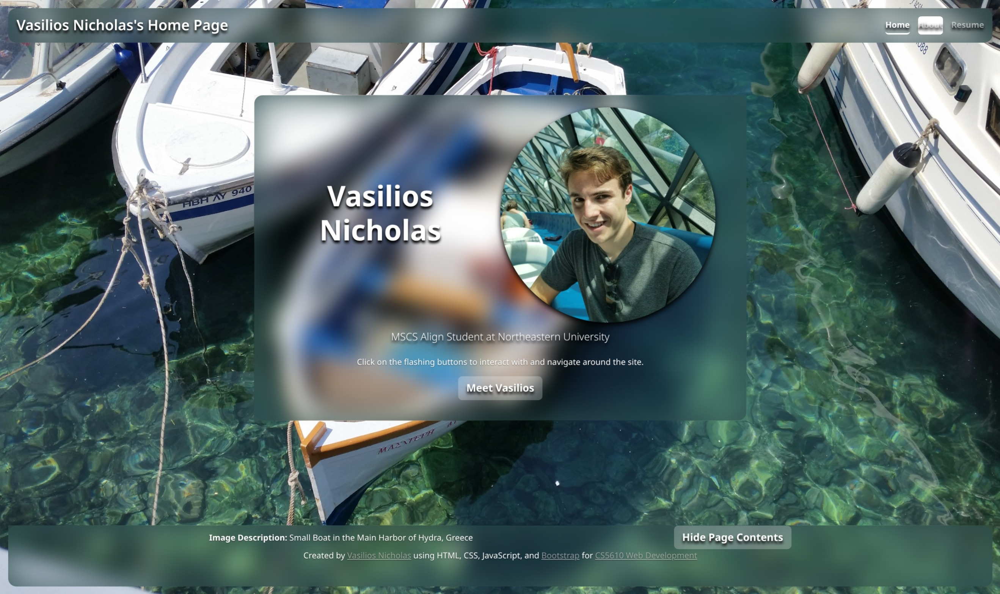

# Vasilios Nicholas's Personal Homepage

A personal homepage built as the first project for **CS5610 Web Development** at Northeastern University. The site introduces who I am, what I'm studying, and what I've worked on, with an interactive, image-driven design inspired by photographs I've taken while traveling.



> *Landing page of my website.*

## Project Objective

The goal of this project is to design and deploy a personal homepage that:

- Introduces me as an MSCS Align student at Northeastern University
- Showcases my background, skills, projects, and resume
- Demonstrates the core front-end skills covered in CS5610: semantic HTML, CSS, vanilla JavaScript, and Bootstrap
- Provides a clean, accessible, and responsive experience across devices
- Lives as a permanent, deployed personal site I can keep updating after the class ends

## Live Demo and Documentation

- **[Deployed Site Link](https://vasiliosnicholas.github.io/Vasilios-Nicholas-Homepage/)**
- **[Video walkthrough](https://youtu.be/vc8qRRkUL2k)**
- **[Slides Link](https://docs.google.com/presentation/d/1Y2LkaBstfhFMyd92CGeEkDtKO_VBtgN9ob7fShZU1GA/edit?usp=sharing)**
- **[Design Document](https://docs.google.com/document/d/1np33YJJzRkS3DVjndzRsWoxsd1QU-9Yrnu1bZEG5Z0o/edit?usp=sharing)**

## Features

- **Multi-page site** — Home, About, and Resume pages, linked through a persistent navigation bar
- **Rotating photographic backgrounds** — The landing page cycles through a set of full-bleed photos driven by `images/backgrounds.json`, each with its own caption
- **Data-driven resume page** — The Resume page is rendered dynamically by `scripts/resume.js` from `data/resume.json`, so updating the resume only requires editing one JSON file
- **Hide / Show page contents** — A vanilla JavaScript toggle that lets visitors temporarily clear the overlay and view the background photo on its own
- **Interactive "flashing" navigation cues** — Subtle animation prompts the visitor to explore the site
- **Responsive layout** — Built on the Bootstrap 5 grid so the page works on mobile, tablet, and desktop
- **Accessible image descriptions** — Each photographic background is captioned so the imagery is meaningful, not just decorative

## Tech Stack

- **HTML5** — Semantic markup, W3C compliant
- **CSS3** — Custom styling layered on top of Bootstrap
- **Vanilla JavaScript** — Interactive behaviors (page-content toggle, navigation effects), no frameworks
- **Bootstrap 5** — Grid system, components, and responsive utilities
- **Git / GitHub** — Version control and hosting

## Project Structure

```
Vasilios-Nicholas-Homepage/
├── index.html              # Landing page
├── about.html              # About page
├── resume.html             # Resume page (rendered from data/resume.json)
├── data/
│   └── resume.json         # Structured resume content
├── scripts/
│   ├── main.js             # Site-wide JavaScript (navigation, background rotation, toggles)
│   └── resume.js           # Renders the resume page from resume.json
├── styles/
│   ├── style.css           # Global custom styles
│   └── timeline.css        # Resume / timeline-specific styles
├── images/
│   ├── background1.png     # Rotating landing-page backgrounds
│   ├── background2.jpg     #   …
│   ├── background3.jpg
│   ├── background4.jpg
│   ├── background5.jpg
│   ├── background6.jpg
│   ├── background7.jpg
│   ├── backgrounds.json    # Captions / metadata for the rotating backgrounds
│   ├── bell_labs_exterior.jpg
│   ├── bell_labs_lobby.jpg
│   ├── homepage-screenshot.jpeg
│   ├── profile_photo.png
│   ├── RA_poster_Final.pdf
│   └── VN_icon.png         # Site favicon / logo
├── eslint.config.js        # ESLint configuration
├── package.json            # Dev dependencies (ESLint, etc.)
├── package-lock.json
├── LICENSE                 # MIT License
└── README.md
```

## Installation and Local Development

The site is plain HTML / CSS / JavaScript, so no build step is required.

1. **Clone the repository**
   ```bash
   git clone https://github.com/vasiliosnicholas/Vasilios-Nicholas-Homepage.git
   cd Vasilios-Nicholas-Homepage
   ```

2. **(Optional) Install dev dependencies** for linting
   ```bash
   npm install
   ```

3. **Open the site**

   Either open `index.html` directly in a browser, or serve the folder with any static server, for example:
   ```bash
   npx http-server .
   ```
   Then visit `http://localhost:8080` in your browser.

## Usage

- Land on **Home** to see the introduction and a brief description of the site
- Use the navigation bar (Home / About / Resume) to move between pages
- Click **Meet Vasilios** on the homepage to jump into the About section
- Use **Hide Page Contents** to dismiss the overlay and see the background photograph
- Image captions at the bottom of each page describe where the photograph was taken

## Design Document

The design document for this project (description, user stories, and wireframes) is available here:

- *(add link to your design document — Google Doc, PDF in the repo, or `docs/` folder)*

## AI Disclosure

This project was developed primarily by hand, with selective use of AI assistance in accordance with the CS5610 course policy. The following disclosures apply:

- **AI tools used:** Claude Opus 4.7
- **What AI was used for:** Assisting with this README, creating the resume page, and helping out with CSS styling.
- **What AI was *not* used for:** The site design, photography, personal content (bio, resume, project descriptions), and the core interactive JavaScript features were authored by me
- **Per-page note:** At least two of the pages on this site were written without AI assistance, in line with the course requirement that AI be used on at most one page
- **Verification:** All AI-suggested code was reviewed, tested, and modified before being committed. I take responsibility for everything in this repository

Specific AI Prompts used:
- You are a full stack developer with years of experience. I am creating a personal site using html, css, Bootstrap and es6 modules. I already created my home page and about me section.  Using the html and css files I provided along with my resume, could you create a resume page that:

   1. displays the contents of my resume as an interactive timeline
   2. uses my css theme  
   3. uses the overall flexbox grid layout from my home page as well
   4. uses new css and javascript files if needed for additional features
   I've also provided my current JS script for reference.

- Yes, please make the layout wider for the timeline section. Additionally, please include the same footer as found in my index.html page including the button in question with the #display-toggle id. I will refactor such that the querySelector in the function for the event listener works with a class instead of a list of child combinators.

- Create CSS for the Bootstrap Accordian example in my about.html to work with my theme.

## Author

**Vasilios Nicholas** — MSCS Align Student, Northeastern University
- GitHub: [@vasiliosnicholas](https://github.com/vasiliosnicholas)

## Course

This project was built for [CS5610 Web Development](https://johnguerra.co/classes/webDevelopment_online_summer_2026/), taught by [Prof. John Alexis Guerra Gómez](https://johnguerra.co/) at Northeastern University, Summer 2026.

## License

This project is licensed under the [MIT License](./LICENSE) — see the LICENSE file for details.
